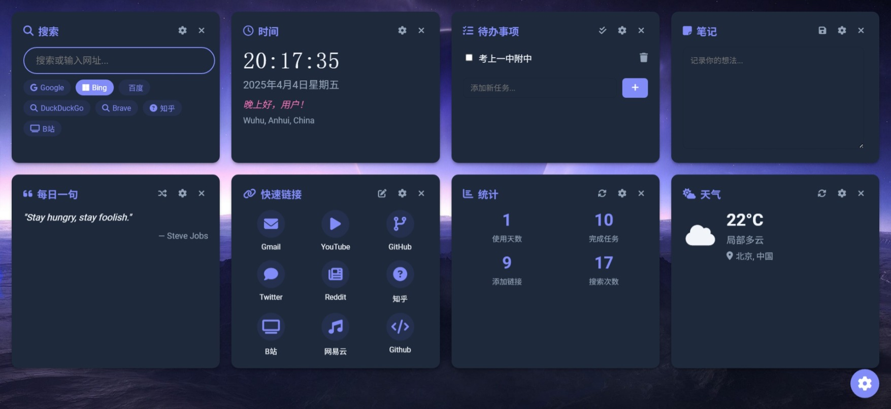
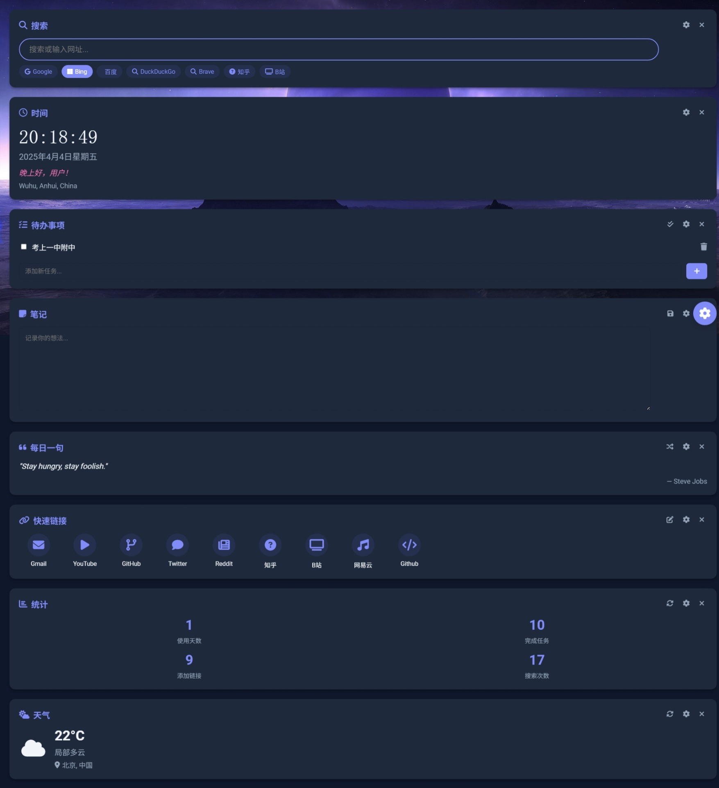
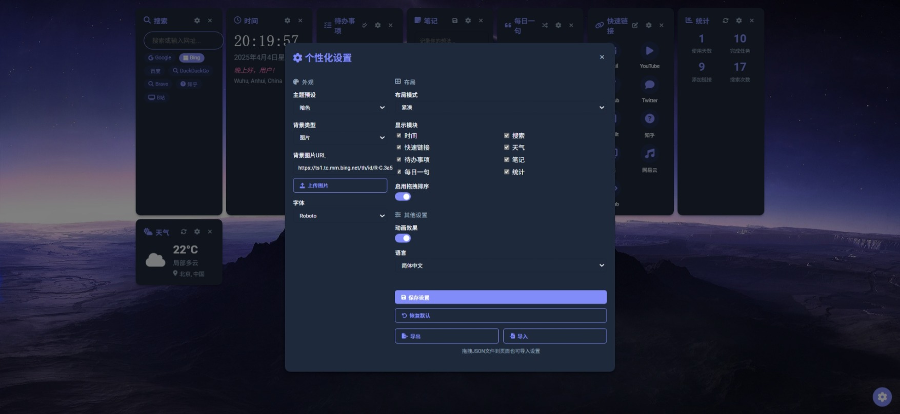

# New Tab - 你的智能起始页

这是一个现代化的浏览器新标签页替代方案，提供时间、天气、快速链接、待办事项等功能。

## 功能特性

- 美观的时间日期显示
- 自定义搜索引擎
- 可拖拽的卡片布局
- 多种主题切换
- 快速访问链接
- 待办事项管理
- 笔记功能

## 安装使用

### 方法一 
1. 克隆或下载本项目
2. 在浏览器中打开index.html

### 方法二
访问 [New Tab](https://dxj20120122.github.io/NewTab/)

## 自定义

- 使用建议的`New Tab`主题，将`NewTab-Settings.json`文件导入或拖入

## 截图

## 浏览器支持

- 现代浏览器(Chrome/Firefox/Edge等

## 许可证

[MIT](LICENSE)

## 贡献

欢迎提交Pull Request或报告Issue。